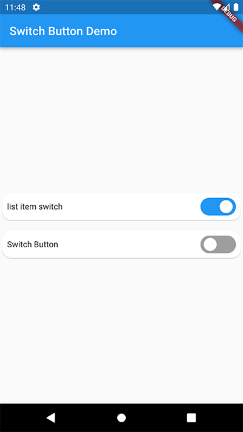

## SwitchButton
[](https://pub.dartlang.org/packages/switch_button)



## Usage

```dart
bool state = false;

@override
Widget build(BuildContext context) {
  return Scaffold(
    appBar: AppBar(
      title: Text(widget.title),
    ),
    body: Center(
      child: SwitchButton(
        value: state,
        onToggle: (val) {
          setState(() {
            state = val;
          });
        },
        child: Text("Switch Button"),
      ),
    ),
  );
}
```


### Installation

Add to pubspec.yaml:

```yaml
dependencies:
  switch_button: ^0.0.1
```

For more info, check out [example project](https://github.com/albukheitysoft/switch_button/tree/master/example).
